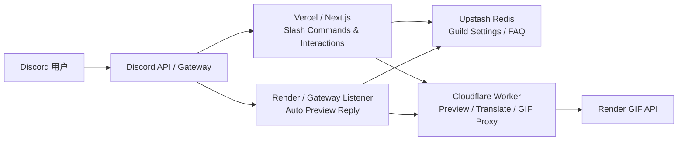

<div align="center">

# Nextjs Discord Bot

**一个基于 Next.js App Router、discord.js、Cloudflare Workers、Upstash Redis 与 Render 的 Discord Bot 项目**  
**提供 Slash Commands、Guild FAQ，以及 X / Twitter、Pixiv、Bluesky 自动预览卡片。**

<p>
  <a href="./README.md">English</a> · <a href="./README-zhtw.md">繁體中文</a> · <a href="./README-zhcn.md">简体中文</a>
</p>

<p>
  
  
  
  
  
  
  
  
</p>

</div>

## 目录

- [项目概览](#项目概览)
- [功能总览](#功能总览)
- [系统架构](#系统架构)
- [推荐的 MVP 部署拓扑](#推荐的-mvp-部署拓扑)
- [快速开始](#快速开始)
- [环境变量](#环境变量)
- [Slash Commands](#slash-commands)
- [自动预览系统](#自动预览系统)
- [推荐的 Render Gateway Listener 方案](#推荐的-render-gateway-listener-方案)
- [Runbooks](#runbooks)
- [开发命令](#开发命令)
- [项目结构](#项目结构)
- [外部参考文档](#外部参考文档)

## 项目概览

这个项目以 **Next.js App Router** 为核心，采用分层部署架构：

- **Vercel / Next.js**：处理 Slash Commands、Interactions、设置面板、FAQ
- **Cloudflare Worker**：负责预览数据标准化、翻译代理、GIF 任务代理
- **Render GIF API**：处理 GIF 转换
- **Render Gateway Listener**：常驻监听 Discord Gateway，实现“用户贴链接，Bot 自动回预览卡”
- **Upstash Redis**：Guild 设置、FAQ、共享状态

这个拆分方式把“交互 webhook”“预览处理”“GIF 任务”和“常驻 Gateway 连接”分离，便于独立部署、监控和故障隔离。

## 功能总览

### Slash Commands

- `/ping`：基础健康检查
- `/help`：显示可用指令与快速开始提示
- `/faq`：Guild FAQ 存储与查询
- `/settings`：Guild 级自动预览设置面板

### 自动预览卡片

当用户在 Guild 频道贴出支持的网址时，Bot 会自动回复预览卡片。

目前支持：

- X / Twitter
- Pixiv
- Bluesky

预览卡支持：

- 帖子作者 / 平台信息
- 文本内容与统计字段
- 图片 / 视频预览
- `🌐` 翻译
- `🎬` GIF 转换
- `🗑️` 收回预览

### Guild 级设置

`/settings` 可配置：

- 整体自动预览开关
- 平台开关：Twitter、Pixiv、Bluesky
- 功能开关：Translate、GIF
- 输出模式：`embed` / `image`
- NSFW 媒体模式
- 默认翻译目标语言

## 系统架构



## 推荐的 MVP 部署拓扑

| 模块             | 角色                          | 建议平台           |
| ---------------- | ----------------------------- | ------------------ |
| Next.js App      | Slash Commands / Interactions | Vercel             |
| Gateway Listener | 自动预览常驻进程              | Render Web Service |
| Media Proxy      | 预览 / 翻译 / GIF 代理        | Cloudflare Workers |
| GIF API          | GIF 转换                      | Render Web Service |
| Redis            | Guild 设置 / FAQ              | Upstash Redis      |

> [!NOTE]
> Gateway listener 建议部署在能稳定通过 Discord Gateway 与 REST 探测的 region。如果某个 region 出现 `429` 或 `Access denied`，应改建其他 region 重新验证。

## 快速开始

### 1. 安装依赖

```bash
pnpm install
```

### 2. 建立环境变量

以 `.env.example` 为基础建立 `.env.local`：

```bash
cp .env.example .env.local
```

### 3. 启动本地开发服务器

```bash
pnpm dev
```

### 4. 如需测试自动预览，额外启动 Gateway Listener

```bash
pnpm gateway:listen
```

## 环境变量

### 核心必要

| 变量                         | 说明                                        |
| ---------------------------- | ------------------------------------------- |
| `NEXT_PUBLIC_APPLICATION_ID` | Discord Application ID                      |
| `PUBLIC_KEY`                 | Discord Interaction Public Key              |
| `BOT_TOKEN`                  | Discord Bot Token                           |
| `REGISTER_COMMANDS_KEY`      | 正式环境注册 Slash Commands 用的 Bearer Key |

### Redis / Guild 设置

| 变量                       | 说明                                    |
| -------------------------- | --------------------------------------- |
| `UPSTASH_REDIS_REST_URL`   | Upstash Redis REST URL                  |
| `UPSTASH_REDIS_REST_TOKEN` | Upstash Redis REST Token                |
| `REDIS_NAMESPACE`          | Redis key namespace，默认 `discord-bot` |

### Media Worker / 预览链路

| 变量                      | 说明                                 |
| ------------------------- | ------------------------------------ |
| `MEDIA_WORKER_BASE_URL`   | Cloudflare Worker base URL           |
| `MEDIA_WORKER_TOKEN`      | Worker Bearer Token                  |
| `MEDIA_WORKER_TIMEOUT_MS` | Next.js 调用 media worker 的 timeout |
| `MEDIA_ALLOWED_DOMAINS`   | 允许自动预览的域名清单               |

### Gateway Listener

| 变量                            | 说明                                           |
| ------------------------------- | ---------------------------------------------- |
| `DISCORD_GATEWAY_TOKEN`         | 专用 Gateway Token；未设置时回退到 `BOT_TOKEN` |
| `GATEWAY_ATTACHMENT_MAX_BYTES`  | 预览附件最大字节数                             |
| `GATEWAY_ATTACHMENT_MAX_ITEMS`  | 预览附件最多项数                               |
| `GATEWAY_ATTACHMENT_TIMEOUT_MS` | 单附件拉取 timeout                             |

## Slash Commands

| 指令                      | 说明                          |
| ------------------------- | ----------------------------- |
| `/ping`                   | 检查 Bot 是否正常响应         |
| `/help`                   | 显示可用指令与快速开始        |
| `/faq get <key>`          | 查询 FAQ                      |
| `/faq list`               | 列出 FAQ keys                 |
| `/faq set <key> <answer>` | 管理员新增 / 更新 FAQ         |
| `/faq delete <key>`       | 管理员删除 FAQ                |
| `/settings`               | 打开 Guild 级自动预览设置面板 |

## 自动预览系统

### 支持平台

- `x.com`
- `twitter.com`
- `pixiv.net`
- `www.pixiv.net`
- `bsky.app`

### 运作方式

1. 用户在 Guild 频道贴出支持的网址
2. Render Gateway Listener 收到 `MESSAGE_CREATE`
3. Listener 读取 Guild 设置与平台开关
4. Listener 调用 Cloudflare Worker 获取标准化 preview payload
5. Bot 回复预览卡，并在适合时附带原生 Discord 媒体附件

### 预览按钮

| 按钮 | 用途                     |
| ---- | ------------------------ |
| `🌐` | 翻译帖子内容             |
| `🎬` | 将可转换媒体送去 GIF API |
| `🗑️` | 收回 Bot 发出的预览卡    |

## 推荐的 Render Gateway Listener 方案

推荐的 MVP 方式：

- **平台**：Render Web Service
- **Health Check Path**：`/healthz`
- **外部保活**：可选择用 UptimeRobot 或同类服务定期 `GET /healthz`
- **Region 选择原则**：以“可稳定通过 Discord Gateway 与 REST 探测”为准

> [!TIP]
> 如果免费 Web Service 会休眠，可以用外部监控定期请求 `/healthz`。如果某个 region 被 Discord / Cloudflare 拦下，直接换 region 测，不要把问题误判成单纯冷启动。

## Runbooks

- [Render Gateway Listener Runbook](docs/zhcn/runbooks/render-gateway-listener.md)
- [Production Register-Commands Runbook](docs/zhcn/runbooks/register-commands.md)

## 开发命令

| 命令                  | 用途                         |
| --------------------- | ---------------------------- |
| `pnpm dev`            | 启动本地开发服务器           |
| `pnpm build`          | 建立 production build        |
| `pnpm start`          | 启动 production server       |
| `pnpm lint`           | 执行 ESLint                  |
| `pnpm typecheck`      | 执行 `tsc --noEmit`          |
| `pnpm test`           | 执行 Vitest                  |
| `pnpm prettier`       | 执行 Prettier 写回           |
| `pnpm gateway:listen` | 启动 Gateway listener        |
| `pnpm worker:smoke`   | Smoke test live media worker |

## 项目结构

```text
.
├── README.md
├── README-zhtw.md
├── README-zhcn.md
├── AGENTS.md
├── docs/
│   ├── en/
│   │   └── runbooks/
│   │       ├── register-commands.md
│   │       └── render-gateway-listener.md
│   ├── zhtw/
│   │   └── runbooks/
│   │       ├── register-commands.md
│   │       └── render-gateway-listener.md
│   └── zhcn/
│       └── runbooks/
│           ├── register-commands.md
│           └── render-gateway-listener.md
├── public/
│   └── favicon.ico
├── scripts/
│   └── smoke-media-worker.mjs
├── src/
│   ├── app/
│   │   ├── layout.tsx
│   │   ├── page.tsx
│   │   └── api/
│   │       └── discord-bot/
│   │           ├── debug/
│   │           │   ├── route.ts
│   │           │   └── route.test.ts
│   │           ├── interactions/
│   │           │   ├── route.ts
│   │           │   └── route.test.ts
│   │           └── register-commands/
│   │               ├── route.ts
│   │               └── route.test.ts
│   ├── commands/
│   │   ├── faq.ts
│   │   ├── faq.test.ts
│   │   ├── help.ts
│   │   ├── index.ts
│   │   ├── ping.ts
│   │   ├── settings.ts
│   │   └── settings.test.ts
│   └── common/
│       ├── configs/
│       │   └── index.ts
│       ├── stores/
│       │   ├── faq-store.ts
│       │   ├── faq-store.test.ts
│       │   ├── guild-settings-store.ts
│       │   ├── guild-settings-store.test.ts
│       │   └── index.ts
│       ├── styles/
│       │   └── globals.css
│       ├── types/
│       │   └── index.ts
│       └── utils/
│           ├── auth.ts
│           ├── auth.test.ts
│           ├── discord-api.ts
│           ├── discord-api.test.ts
│           ├── getCommands.ts
│           ├── index.ts
│           ├── media-component-handler.ts
│           ├── media-component-handler.test.ts
│           ├── media-link.ts
│           ├── media-link.test.ts
│           ├── media-worker.ts
│           ├── media-worker.test.ts
│           ├── preview-card.ts
│           ├── request-logger.ts
│           ├── settings-actor.ts
│           ├── settings-panel.ts
│           ├── ui-copy.json
│           ├── ui-text.ts
│           ├── verify-discord-request.ts
│           └── verify-discord-request.test.ts
└── worker/
    ├── cloudflare-media-proxy/
    │   ├── README.md
    │   ├── wrangler.toml
    │   └── src/
    │       ├── index.ts
    │       └── index.test.ts
    ├── gateway-listener/
    │   ├── README.md
    │   ├── index.mjs
    │   ├── preview-attachments.mjs
    │   ├── preview-attachments.test.ts
    │   └── ui-text.mjs
    └── render-gif-api/
        ├── README.md
        ├── Dockerfile
        ├── app.py
        ├── requirements.txt
        └── start.sh
```

## 外部参考文档

- [Render Web Services](https://render.com/docs/web-services)
- [Render Health Checks](https://render.com/docs/health-checks)
- [Render Deploys](https://render.com/docs/deploys)
- [Discord Gateway](https://docs.discord.com/developers/events/gateway)
- [Discord Events Overview](https://docs.discord.com/developers/events/overview)
