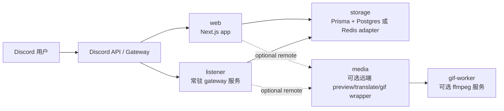

<div align="center">

# Nextjs Discord Bot

**先从 Render 开始，后续再自由拆分。**  
**一个可组合部署的 Discord Bot，包含 slash commands、guild settings、FAQ 存储，以及 X / Twitter、Pixiv、Bluesky 自动预览卡片。**

<p>
  <a href="./README.md">English</a> · <a href="./README-zhtw.md">繁體中文</a> · <a href="./README-zhcn.md">简体中文</a>
</p>

<p>
  
  
  
  
  
  
</p>

</div>

## 目录

- [Overview](#overview)
- [Deployment Profiles](#deployment-profiles)
- [One-Click Deploy](#one-click-deploy)
- [Service Model](#service-model)
- [Quick Start: Render Standard](#quick-start-render-standard)
- [Environment Variables](#environment-variables)
- [Split Deployment Examples](#split-deployment-examples)
- [Runbooks](#runbooks)
- [Development Commands](#development-commands)

## Overview

这个 repo 是一个基于 **Next.js App Router** 的 Discord Bot，部署模型改成：

- 默认先走单平台 **Render**
- 默认存储层是 **Prisma + Postgres**
- 需要自动预览时，再补一个常驻 **gateway listener**
- 后续可以把 `web`、`media`、`gif-worker` 任意拆出去，而不必改动指令层

核心功能：

- `/ping`
- `/help`
- `/faq`
- `/settings`
- X / Twitter、Pixiv、Bluesky 自动预览卡片
- 可选的翻译与 GIF 动作

## Deployment Profiles

| Profile           | 必需服务                                                | FAQ / settings | 自动预览 | 翻译                | GIF                        | 平台数量 |
| ----------------- | ------------------------------------------------------- | -------------- | -------- | ------------------- | -------------------------- | -------- |
| `Starter`         | `web` + `db`                                            | Yes            | No       | No                  | No                         | 1        |
| `Render Standard` | `web` + `listener` + `db`                               | Yes            | Yes      | Provider 配好后可用 | 可通过远端 gif worker 启用 | 1        |
| `Split`           | `web` + `listener` + `db` + 可选 `media` / `gif-worker` | Yes            | Yes      | Yes                 | 可选                       | 2+       |

README 的官方默认路径：

- 使用 **Render Standard**
- `GIF_MODE` 默认保持 `disabled`
- 只有在翻译 provider 配置完成后才显示 translate 按钮

## One-Click Deploy

按你要启动的角色，直接点对应按钮：

| 目标               | 会部署什么                                                             | 按钮                                                                                                                                                                                                                                                                                                                                                                                                                                                                                                                                                                                                                                                                                                                                                                                                                                                                                   |
| ------------------ | ---------------------------------------------------------------------- | -------------------------------------------------------------------------------------------------------------------------------------------------------------------------------------------------------------------------------------------------------------------------------------------------------------------------------------------------------------------------------------------------------------------------------------------------------------------------------------------------------------------------------------------------------------------------------------------------------------------------------------------------------------------------------------------------------------------------------------------------------------------------------------------------------------------------------------------------------------------------------------- |
| `Render Standard`  | 在 Render 上一次拉起 `web` + `listener` + `db`                         | [](https://render.com/deploy?repo=https%3A%2F%2Fgithub.com%2FBlackishGreen33%2FNextjs-Discord-Bot)                                                                                                                                                                                                                                                                                                                                                                                                                                                                                                                                                                                                                                                                                                           |
| `Vercel Web`       | 只部署 `web`。数据库需要自行提供，`listener` 仍要放在 always-on host。 | [](https://vercel.com/new/clone?repository-url=https%3A%2F%2Fgithub.com%2FBlackishGreen33%2FNextjs-Discord-Bot&project-name=nextjs-discord-bot-web&build-command=pnpm%20prisma%3Agenerate%20%26%26%20pnpm%20build&env=NEXT_PUBLIC_APPLICATION_ID%2CPUBLIC_KEY%2CBOT_TOKEN%2CREGISTER_COMMANDS_KEY%2CDATABASE_URL%2CSTORAGE_DRIVER%2CMEDIA_MODE%2CGIF_MODE%2CTRANSLATE_PROVIDER&envDescription=Set%20Discord%20app%20secrets%20and%20an%20external%20Postgres%20URL.%20Auto%20preview%20still%20needs%20the%20gateway%20listener%20on%20an%20always-on%20host.&envLink=https%3A%2F%2Fgithub.com%2FBlackishGreen33%2FNextjs-Discord-Bot%23environment-variables&envDefaults=%7B%22STORAGE_DRIVER%22%3A%22prisma%22%2C%22MEDIA_MODE%22%3A%22embedded%22%2C%22GIF_MODE%22%3A%22disabled%22%2C%22TRANSLATE_PROVIDER%22%3A%22disabled%22%7D) |
| `Cloudflare Media` | 部署可选远端 `media` 服务，来源目录是 `worker/cloudflare-media-proxy`  | [](https://deploy.workers.cloudflare.com/?url=https%3A%2F%2Fgithub.com%2FBlackishGreen33%2FNextjs-Discord-Bot%2Ftree%2Fmain%2Fworker%2Fcloudflare-media-proxy)                                                                                                                                                                                                                                                                                                                                                                                                                                                                                                                                                                                                                                                    |

说明：

- Render 按钮会使用 [`render.yaml`](./render.yaml) 建立推荐的 `Render Standard` profile。
- Vercel 按钮只负责 `web`，自动预览仍然需要 `listener`。
- Cloudflare 按钮只部署可选的远端 `media` wrapper。
- Railway 官方按钮要求先发布模板，所以这个 repo 目前没有放 Railway 按钮。

## Service Model



服务角色：

- `web`
  处理 slash commands、interaction 验签、component callbacks、指令注册与 debug route。
- `listener`
  维护 Discord Gateway 连接，并且只由它负责 `MESSAGE_CREATE` 自动回复预览卡片。
- `media`
  可选远端 wrapper，提供 `/v1/preview`、`/v1/translate`、`/v1/gif`。默认不需要，`MEDIA_MODE=embedded` 即可。
- `gif-worker`
  可选 ffmpeg 转码服务，只有需要 GIF 转换时才要部署。

## Quick Start: Render Standard

这是官方推荐的部署方式。

### 1. 安装依赖

```bash
pnpm install
pnpm prisma:generate
```

### 2. 创建环境变量

```bash
cp .env.example .env.local
```

最小 Render Standard env：

```bash
NEXT_PUBLIC_APPLICATION_ID=
PUBLIC_KEY=
BOT_TOKEN=
REGISTER_COMMANDS_KEY=
DISCORD_GATEWAY_TOKEN=

STORAGE_DRIVER=prisma
DATABASE_URL=

MEDIA_MODE=embedded
GIF_MODE=disabled
TRANSLATE_PROVIDER=disabled
```

### 3. 创建 Postgres 并应用 schema

创建 **Render Postgres**，并把 `DATABASE_URL` 同时提供给：

- `discord-bot-web`
- `discord-bot-listener`

然后在能连到数据库的环境执行一次：

```bash
pnpm prisma:push
```

### 4. 部署 web app

建议的 Render Web Service 设置：

- Build command: `pnpm install && pnpm prisma:generate && pnpm build`
- Start command: `pnpm start`

### 5. 部署 gateway listener

建议的 Render Web Service 设置：

- Build command: `pnpm install && pnpm prisma:generate`
- Start command: `pnpm gateway:listen`
- Health check path: `/healthz`

注意：

- 生产环境同一时间只保留 **一个** production listener
- region 需要同时通过 Discord Gateway login 与 Discord REST probe

### 6. 注册 commands

开发环境：

- 可以用首页按钮，或直接调用 `POST /api/discord-bot/register-commands`

生产环境：

- 调用 `POST /api/discord-bot/register-commands`
- 带上 `Authorization: Bearer <REGISTER_COMMANDS_KEY>`

### 7. 验证部署

确认：

- `https://<listener>/healthz`
- guild 内 `/settings` 与 `/faq`
- 在 guild 频道发送新的 `x.com`、`pixiv.net`、`bsky.app` 链接

## Environment Variables

### Discord Core

| 变量                         | 由谁使用          | 说明                                       |
| ---------------------------- | ----------------- | ------------------------------------------ |
| `NEXT_PUBLIC_APPLICATION_ID` | `web`             | Discord application ID                     |
| `PUBLIC_KEY`                 | `web`             | Discord interaction 验签公钥               |
| `BOT_TOKEN`                  | `web`, `listener` | Bot token                                  |
| `REGISTER_COMMANDS_KEY`      | `web`             | 保护生产环境 command registration          |
| `DISCORD_GATEWAY_TOKEN`      | `listener`        | 可选专用 token；未设置时回退到 `BOT_TOKEN` |

### Storage

| 变量                       | 由谁使用          | 说明                           |
| -------------------------- | ----------------- | ------------------------------ |
| `STORAGE_DRIVER`           | `web`, `listener` | `prisma`（默认）或 `redis`     |
| `DATABASE_URL`             | `web`, `listener` | `STORAGE_DRIVER=prisma` 时必填 |
| `UPSTASH_REDIS_REST_URL`   | `web`, `listener` | `STORAGE_DRIVER=redis` 时必填  |
| `UPSTASH_REDIS_REST_TOKEN` | `web`, `listener` | `STORAGE_DRIVER=redis` 时必填  |
| `REDIS_NAMESPACE`          | `web`, `listener` | 可选 Redis key namespace       |

### Media

| 变量                     | 由谁使用                   | 说明                                     |
| ------------------------ | -------------------------- | ---------------------------------------- |
| `MEDIA_MODE`             | `web`, `listener`          | `embedded`（默认）、`remote`、`disabled` |
| `MEDIA_SERVICE_BASE_URL` | `web`, `listener`          | `MEDIA_MODE=remote` 时必填               |
| `MEDIA_SERVICE_TOKEN`    | `web`, `listener`          | 远端 media service 的 bearer token       |
| `MEDIA_TIMEOUT_MS`       | `web`, `listener`          | 远端 media request timeout               |
| `MEDIA_ALLOWED_DOMAINS`  | `web`, `listener`, `media` | 支持平台 allowlist                       |
| `TRANSLATE_PROVIDER`     | `web`, `listener`          | `disabled`（默认）或 `libretranslate`    |
| `TRANSLATE_API_BASE_URL` | `web`, `listener`, `media` | embedded LibreTranslate 模式必填         |
| `TRANSLATE_API_KEY`      | `web`, `listener`, `media` | 可选翻译 provider key                    |

### GIF

| 变量                   | 由谁使用                   | 说明                          |
| ---------------------- | -------------------------- | ----------------------------- |
| `GIF_MODE`             | `web`, `listener`          | `disabled`（默认）或 `remote` |
| `GIF_SERVICE_BASE_URL` | `web`, `listener`, `media` | `GIF_MODE=remote` 时必填      |
| `GIF_SERVICE_TOKEN`    | `web`, `listener`, `media` | gif service 的 bearer token   |
| `FFMPEG_TIMEOUT_SEC`   | `gif-worker`               | 仅 gif-worker 使用            |
| `MAX_GIF_DURATION_SEC` | `gif-worker`               | 仅 gif-worker 使用            |
| `GIF_SCALE_WIDTH`      | `gif-worker`               | 仅 gif-worker 使用            |
| `GIF_FPS`              | `gif-worker`               | 仅 gif-worker 使用            |

### Listener

| 变量                            | 由谁使用   | 说明                   |
| ------------------------------- | ---------- | ---------------------- |
| `GATEWAY_ATTACHMENT_MAX_BYTES`  | `listener` | 单个预览附件最大 bytes |
| `GATEWAY_ATTACHMENT_MAX_ITEMS`  | `listener` | 可转传的媒体数量上限   |
| `GATEWAY_ATTACHMENT_TIMEOUT_MS` | `listener` | 单个附件转传 timeout   |

### Legacy Compatibility

项目仍接受以下旧 env 别名一个 deprecation cycle：

- `MEDIA_WORKER_BASE_URL` -> `MEDIA_SERVICE_BASE_URL`
- `MEDIA_WORKER_TOKEN` -> `MEDIA_SERVICE_TOKEN`
- `MEDIA_WORKER_TIMEOUT_MS` -> `MEDIA_TIMEOUT_MS`

## Split Deployment Examples

### 1. 把 `web` 搬到 Vercel，`listener + db` 留在 Render

- Discord core env 保持一致
- `listener` 仍需部署在 always-on host
- 共享同一个 `DATABASE_URL`

### 2. 把 `media` 搬到 Cloudflare Worker

- 设置 `MEDIA_MODE=remote`
- `MEDIA_SERVICE_BASE_URL` 指向 worker
- 需要 bearer auth 时使用 `MEDIA_SERVICE_TOKEN`
- `/v1/preview`、`/v1/translate`、`/v1/gif` 路径保持不变

### 3. 增加独立 `gif-worker`

- `MEDIA_MODE` 保持 `embedded`
- 设置 `GIF_MODE=remote`
- `GIF_SERVICE_BASE_URL` 指向 ffmpeg worker
- 即使 GIF 关闭或不可用，preview 仍可正常工作

## Runbooks

进阶运维文档：

- [Render Gateway Listener Runbook](docs/zhcn/runbooks/render-gateway-listener.md)
- [Production Register-Commands Runbook](docs/zhcn/runbooks/register-commands.md)
- [Optional Cloudflare Media Service](worker/cloudflare-media-proxy/README.md)
- [Optional Render GIF Worker](worker/render-gif-api/README.md)

## Development Commands

| 命令                   | 用途                                       |
| ---------------------- | ------------------------------------------ |
| `pnpm dev`             | 启动本地开发服务器                         |
| `pnpm build`           | 构建 production bundle                     |
| `pnpm start`           | 启动 production server                     |
| `pnpm gateway:listen`  | 启动 gateway listener                      |
| `pnpm prisma:generate` | 生成 Prisma client                         |
| `pnpm prisma:push`     | 将 Prisma schema 应用到数据库              |
| `pnpm worker:smoke`    | 对 live remote media service 做 smoke test |
| `pnpm lint`            | 运行 ESLint                                |
| `pnpm typecheck`       | 运行 `tsc --noEmit`                        |
| `pnpm test`            | 运行 Vitest                                |
| `pnpm prettier`        | 运行 Prettier                              |
