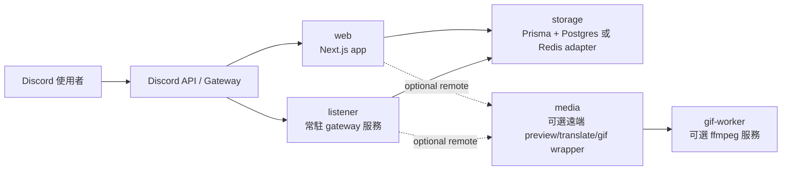

<div align="center">

# Nextjs Discord Bot

**先從 Render 開始，之後再自由拆分。**  
**一個可組合部署的 Discord Bot，包含 slash commands、guild settings、FAQ 儲存，以及 X / Twitter、Pixiv、Bluesky 自動預覽卡片。**

<p>
  <a href="./README.md">English</a> · <a href="./README-zhtw.md">繁體中文</a> · <a href="./README-zhcn.md">简体中文</a>
</p>

<p>
  
  
  
  
  
  
</p>

</div>

## 目錄

- [Overview](#overview)
- [Deployment Profiles](#deployment-profiles)
- [One-Click Deploy](#one-click-deploy)
- [Service Model](#service-model)
- [Quick Start: Render Standard](#quick-start-render-standard)
- [Environment Variables](#environment-variables)
- [Split Deployment Examples](#split-deployment-examples)
- [Runbooks](#runbooks)
- [Development Commands](#development-commands)

## Overview

這個 repo 是以 **Next.js App Router** 實作的 Discord Bot，部署模型改成：

- 預設先走單平台 **Render**
- 預設資料層是 **Prisma + Postgres**
- 需要自動預覽時，再加上常駐 **gateway listener**
- 後續可把 `web`、`media`、`gif-worker` 任意拆出去，而不用改指令層

核心功能：

- `/ping`
- `/help`
- `/faq`
- `/settings`
- X / Twitter、Pixiv、Bluesky 自動預覽卡片
- 可選的翻譯與 GIF 動作

## Deployment Profiles

| Profile           | 必要服務                                                | FAQ / settings | 自動預覽 | 翻譯                | GIF                        | 平台數 |
| ----------------- | ------------------------------------------------------- | -------------- | -------- | ------------------- | -------------------------- | ------ |
| `Starter`         | `web` + `db`                                            | Yes            | No       | No                  | No                         | 1      |
| `Render Standard` | `web` + `listener` + `db`                               | Yes            | Yes      | Provider 設好後可用 | 可透過遠端 gif worker 啟用 | 1      |
| `Split`           | `web` + `listener` + `db` + 可選 `media` / `gif-worker` | Yes            | Yes      | Yes                 | 可選                       | 2+     |

README 的官方預設路徑：

- 使用 **Render Standard**
- `GIF_MODE` 預設維持 `disabled`
- 只有在翻譯 provider 設好後才顯示 translate 按鈕

## One-Click Deploy

依照你要啟動的角色，直接點對應按鈕：

| 目標               | 會部署什麼                                                           | 按鈕                                                                                                                                                                                                                                                                                                                                                                                                                                                                                                                                                                                                                                                                                                                                                                                                                                                                                   |
| ------------------ | -------------------------------------------------------------------- | -------------------------------------------------------------------------------------------------------------------------------------------------------------------------------------------------------------------------------------------------------------------------------------------------------------------------------------------------------------------------------------------------------------------------------------------------------------------------------------------------------------------------------------------------------------------------------------------------------------------------------------------------------------------------------------------------------------------------------------------------------------------------------------------------------------------------------------------------------------------------------------- |
| `Render Standard`  | 在 Render 上一次建立 `web` + `listener` + `db`                       | [](https://render.com/deploy?repo=https%3A%2F%2Fgithub.com%2FBlackishGreen33%2FNextjs-Discord-Bot)                                                                                                                                                                                                                                                                                                                                                                                                                                                                                                                                                                                                                                                                                                           |
| `Vercel Web`       | 只部署 `web`。資料庫需自行提供，`listener` 仍需放在 always-on host。 | [](https://vercel.com/new/clone?repository-url=https%3A%2F%2Fgithub.com%2FBlackishGreen33%2FNextjs-Discord-Bot&project-name=nextjs-discord-bot-web&build-command=pnpm%20prisma%3Agenerate%20%26%26%20pnpm%20build&env=NEXT_PUBLIC_APPLICATION_ID%2CPUBLIC_KEY%2CBOT_TOKEN%2CREGISTER_COMMANDS_KEY%2CDATABASE_URL%2CSTORAGE_DRIVER%2CMEDIA_MODE%2CGIF_MODE%2CTRANSLATE_PROVIDER&envDescription=Set%20Discord%20app%20secrets%20and%20an%20external%20Postgres%20URL.%20Auto%20preview%20still%20needs%20the%20gateway%20listener%20on%20an%20always-on%20host.&envLink=https%3A%2F%2Fgithub.com%2FBlackishGreen33%2FNextjs-Discord-Bot%23environment-variables&envDefaults=%7B%22STORAGE_DRIVER%22%3A%22prisma%22%2C%22MEDIA_MODE%22%3A%22embedded%22%2C%22GIF_MODE%22%3A%22disabled%22%2C%22TRANSLATE_PROVIDER%22%3A%22disabled%22%7D) |
| `Cloudflare Media` | 部署可選的遠端 `media` 服務，來源是 `worker/cloudflare-media-proxy`  | [](https://deploy.workers.cloudflare.com/?url=https%3A%2F%2Fgithub.com%2FBlackishGreen33%2FNextjs-Discord-Bot%2Ftree%2Fmain%2Fworker%2Fcloudflare-media-proxy)                                                                                                                                                                                                                                                                                                                                                                                                                                                                                                                                                                                                                                                    |

說明：

- Render 按鈕會使用 [`render.yaml`](./render.yaml) 建立推薦的 `Render Standard` profile。
- Vercel 按鈕只負責 `web`，自動預覽仍需 `listener`。
- Cloudflare 按鈕只部署可選的遠端 `media` wrapper。
- Railway 官方按鈕必須先有已發佈的 template，所以這個 repo 目前沒有放 Railway 按鈕。

## Service Model



服務角色：

- `web`
  處理 slash commands、interaction 驗簽、component callbacks、指令註冊與 debug route。
- `listener`
  維持 Discord Gateway 連線，且只由它負責 `MESSAGE_CREATE` 自動回覆預覽卡片。
- `media`
  可選遠端 wrapper，提供 `/v1/preview`、`/v1/translate`、`/v1/gif`。預設不需要，`MEDIA_MODE=embedded` 即可。
- `gif-worker`
  可選 ffmpeg 轉檔服務，只有你要 GIF 轉換時才需要。

## Quick Start: Render Standard

這是官方推薦的部署方式。

### 1. 安裝依賴

```bash
pnpm install
pnpm prisma:generate
```

### 2. 建立環境變數

```bash
cp .env.example .env.local
```

最小 Render Standard env：

```bash
NEXT_PUBLIC_APPLICATION_ID=
PUBLIC_KEY=
BOT_TOKEN=
REGISTER_COMMANDS_KEY=
DISCORD_GATEWAY_TOKEN=

STORAGE_DRIVER=prisma
DATABASE_URL=

MEDIA_MODE=embedded
GIF_MODE=disabled
TRANSLATE_PROVIDER=disabled
```

### 3. 建立 Postgres 並套用 schema

建立 **Render Postgres**，並把 `DATABASE_URL` 同時提供給：

- `discord-bot-web`
- `discord-bot-listener`

接著在可連到資料庫的環境執行一次：

```bash
pnpm prisma:push
```

### 4. 部署 web app

建議的 Render Web Service 設定：

- Build command: `pnpm install && pnpm prisma:generate && pnpm build`
- Start command: `pnpm start`

### 5. 部署 gateway listener

建議的 Render Web Service 設定：

- Build command: `pnpm install && pnpm prisma:generate`
- Start command: `pnpm gateway:listen`
- Health check path: `/healthz`

注意：

- 正式環境同一時間只保留 **一個** production listener
- region 要同時能通過 Discord Gateway login 與 Discord REST probe

### 6. 註冊 commands

開發環境：

- 可用首頁按鈕，或直接呼叫 `POST /api/discord-bot/register-commands`

正式環境：

- 呼叫 `POST /api/discord-bot/register-commands`
- 帶上 `Authorization: Bearer <REGISTER_COMMANDS_KEY>`

### 7. 驗證部署

確認：

- `https://<listener>/healthz`
- guild 內 `/settings` 與 `/faq`
- 在 guild 頻道貼新的 `x.com`、`pixiv.net`、`bsky.app` 連結

## Environment Variables

### Discord Core

| 變數                         | 由誰使用          | 說明                                     |
| ---------------------------- | ----------------- | ---------------------------------------- |
| `NEXT_PUBLIC_APPLICATION_ID` | `web`             | Discord application ID                   |
| `PUBLIC_KEY`                 | `web`             | Discord interaction 驗簽公鑰             |
| `BOT_TOKEN`                  | `web`, `listener` | Bot token                                |
| `REGISTER_COMMANDS_KEY`      | `web`             | 保護正式環境 command registration        |
| `DISCORD_GATEWAY_TOKEN`      | `listener`        | 可選專用 token；未設時回退到 `BOT_TOKEN` |

### Storage

| 變數                       | 由誰使用          | 說明                           |
| -------------------------- | ----------------- | ------------------------------ |
| `STORAGE_DRIVER`           | `web`, `listener` | `prisma`（預設）或 `redis`     |
| `DATABASE_URL`             | `web`, `listener` | `STORAGE_DRIVER=prisma` 時必填 |
| `UPSTASH_REDIS_REST_URL`   | `web`, `listener` | `STORAGE_DRIVER=redis` 時必填  |
| `UPSTASH_REDIS_REST_TOKEN` | `web`, `listener` | `STORAGE_DRIVER=redis` 時必填  |
| `REDIS_NAMESPACE`          | `web`, `listener` | 可選 Redis key namespace       |

### Media

| 變數                     | 由誰使用                   | 說明                                     |
| ------------------------ | -------------------------- | ---------------------------------------- |
| `MEDIA_MODE`             | `web`, `listener`          | `embedded`（預設）、`remote`、`disabled` |
| `MEDIA_SERVICE_BASE_URL` | `web`, `listener`          | `MEDIA_MODE=remote` 時必填               |
| `MEDIA_SERVICE_TOKEN`    | `web`, `listener`          | 遠端 media service 的 bearer token       |
| `MEDIA_TIMEOUT_MS`       | `web`, `listener`          | 遠端 media request timeout               |
| `MEDIA_ALLOWED_DOMAINS`  | `web`, `listener`, `media` | 支援平台 allowlist                       |
| `TRANSLATE_PROVIDER`     | `web`, `listener`          | `disabled`（預設）或 `libretranslate`    |
| `TRANSLATE_API_BASE_URL` | `web`, `listener`, `media` | embedded LibreTranslate 模式必填         |
| `TRANSLATE_API_KEY`      | `web`, `listener`, `media` | 可選翻譯 provider key                    |

### GIF

| 變數                   | 由誰使用                   | 說明                          |
| ---------------------- | -------------------------- | ----------------------------- |
| `GIF_MODE`             | `web`, `listener`          | `disabled`（預設）或 `remote` |
| `GIF_SERVICE_BASE_URL` | `web`, `listener`, `media` | `GIF_MODE=remote` 時必填      |
| `GIF_SERVICE_TOKEN`    | `web`, `listener`, `media` | gif service 的 bearer token   |
| `FFMPEG_TIMEOUT_SEC`   | `gif-worker`               | 只給 gif-worker 使用          |
| `MAX_GIF_DURATION_SEC` | `gif-worker`               | 只給 gif-worker 使用          |
| `GIF_SCALE_WIDTH`      | `gif-worker`               | 只給 gif-worker 使用          |
| `GIF_FPS`              | `gif-worker`               | 只給 gif-worker 使用          |

### Listener

| 變數                            | 由誰使用   | 說明                     |
| ------------------------------- | ---------- | ------------------------ |
| `GATEWAY_ATTACHMENT_MAX_BYTES`  | `listener` | 單一預覽附件的最大 bytes |
| `GATEWAY_ATTACHMENT_MAX_ITEMS`  | `listener` | 可轉傳的媒體數量上限     |
| `GATEWAY_ATTACHMENT_TIMEOUT_MS` | `listener` | 單一附件轉傳 timeout     |

### Legacy Compatibility

專案仍接受以下舊 env 別名一個 deprecation cycle：

- `MEDIA_WORKER_BASE_URL` -> `MEDIA_SERVICE_BASE_URL`
- `MEDIA_WORKER_TOKEN` -> `MEDIA_SERVICE_TOKEN`
- `MEDIA_WORKER_TIMEOUT_MS` -> `MEDIA_TIMEOUT_MS`

## Split Deployment Examples

### 1. 把 `web` 搬去 Vercel，`listener + db` 留在 Render

- Discord core env 維持相同
- `listener` 仍需部署在 always-on host
- 共用同一組 `DATABASE_URL`

### 2. 把 `media` 搬去 Cloudflare Worker

- 設定 `MEDIA_MODE=remote`
- `MEDIA_SERVICE_BASE_URL` 指向 worker
- 需要 bearer auth 時使用 `MEDIA_SERVICE_TOKEN`
- `/v1/preview`、`/v1/translate`、`/v1/gif` 路徑維持不變

### 3. 加一個獨立 `gif-worker`

- `MEDIA_MODE` 維持 `embedded`
- 設定 `GIF_MODE=remote`
- `GIF_SERVICE_BASE_URL` 指向 ffmpeg worker
- 即使 GIF 停用或不可用，preview 仍可正常運作

## Runbooks

進階維運文件：

- [Render Gateway Listener Runbook](docs/zhtw/runbooks/render-gateway-listener.md)
- [Production Register-Commands Runbook](docs/zhtw/runbooks/register-commands.md)
- [Optional Cloudflare Media Service](worker/cloudflare-media-proxy/README.md)
- [Optional Render GIF Worker](worker/render-gif-api/README.md)

## Development Commands

| 指令                   | 用途                                       |
| ---------------------- | ------------------------------------------ |
| `pnpm dev`             | 啟動本機開發伺服器                         |
| `pnpm build`           | 建立 production bundle                     |
| `pnpm start`           | 啟動 production server                     |
| `pnpm gateway:listen`  | 啟動 gateway listener                      |
| `pnpm prisma:generate` | 產生 Prisma client                         |
| `pnpm prisma:push`     | 將 Prisma schema 套用到資料庫              |
| `pnpm worker:smoke`    | 對 live remote media service 做 smoke test |
| `pnpm lint`            | 執行 ESLint                                |
| `pnpm typecheck`       | 執行 `tsc --noEmit`                        |
| `pnpm test`            | 執行 Vitest                                |
| `pnpm prettier`        | 執行 Prettier                              |
