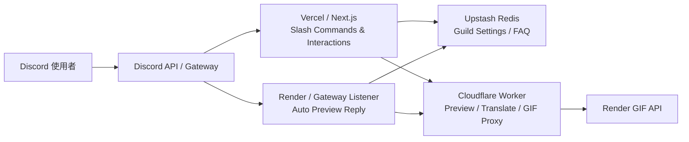

<div align="center">

# Nextjs Discord Bot

**以 Next.js App Router、discord.js、Cloudflare Workers、Upstash Redis 與 Render 組成的 Discord Bot 專案**  
**提供 Slash Commands、Guild FAQ，以及 X / Twitter、Pixiv、Bluesky 自動預覽卡片。**

<p>
  <a href="./README.md">English</a> · <a href="./README-zhtw.md">繁體中文</a> · <a href="./README-zhcn.md">简体中文</a>
</p>

<p>
  
  
  
  
  
  
  
  
</p>

</div>

## 目錄

- [專案概覽](#專案概覽)
- [功能總覽](#功能總覽)
- [系統架構](#系統架構)
- [推薦的 MVP 部署拓撲](#推薦的-mvp-部署拓撲)
- [快速開始](#快速開始)
- [環境變數](#環境變數)
- [Slash Commands](#slash-commands)
- [自動預覽系統](#自動預覽系統)
- [推薦的 Render Gateway Listener 方式](#推薦的-render-gateway-listener-方式)
- [Runbooks](#runbooks)
- [開發指令](#開發指令)
- [專案結構](#專案結構)
- [外部參考文件](#外部參考文件)

## 專案概覽

這個專案是以 **Next.js App Router** 為核心的 Discord Bot，採用明確分層的部署架構：

- **Vercel / Next.js**：處理 Slash Commands、Interactions、設定面板、FAQ
- **Cloudflare Worker**：負責預覽資料正規化、翻譯代理、GIF 任務代理
- **Render GIF API**：處理 GIF 轉檔
- **Render Gateway Listener**：常駐監聽 Discord Gateway，實現「使用者貼連結，Bot 自動回預覽卡」
- **Upstash Redis**：Guild 設定、FAQ、共享狀態

這個拆法把「互動 webhook」、「預覽處理」、「GIF 任務」和「常駐 Gateway 連線」分開，方便獨立部署、監控與故障隔離。

## 功能總覽

### Slash Commands

- `/ping`：基本健康檢查
- `/help`：顯示可用指令與快速開始提示
- `/faq`：Guild FAQ 儲存與查詢
- `/settings`：Guild 級自動預覽設定面板

### 自動預覽卡片

當使用者在 Guild 頻道貼出支援網址時，Bot 可自動回覆預覽卡片。

目前支援：

- X / Twitter
- Pixiv
- Bluesky

預覽卡支援：

- 貼文作者 / 平台資訊
- 文字內容與統計欄位
- 圖片 / 影片預覽
- `🌐` 翻譯
- `🎬` GIF 轉換
- `🗑️` 收回預覽

### Guild 級設定

`/settings` 可設定：

- 整體自動預覽開關
- 平台開關：Twitter、Pixiv、Bluesky
- 功能開關：Translate、GIF
- 輸出模式：`embed` / `image`
- NSFW 媒體模式
- 預設翻譯目標語言

## 系統架構



## 推薦的 MVP 部署拓撲

| 模組             | 角色                          | 建議平台           |
| ---------------- | ----------------------------- | ------------------ |
| Next.js App      | Slash Commands / Interactions | Vercel             |
| Gateway Listener | 自動預覽常駐程序              | Render Web Service |
| Media Proxy      | 預覽 / 翻譯 / GIF 代理        | Cloudflare Workers |
| GIF API          | GIF 轉檔                      | Render Web Service |
| Redis            | Guild 設定 / FAQ              | Upstash Redis      |

> [!NOTE]
> Gateway listener 建議部署在可穩定通過 Discord Gateway 與 REST 探測的 region。若某個 region 出現 `429` 或 `Access denied`，應改建其他 region 重新驗證。

## 快速開始

### 1. 安裝依賴

```bash
pnpm install
```

### 2. 建立環境變數

以 `.env.example` 為基礎建立 `.env.local`：

```bash
cp .env.example .env.local
```

### 3. 啟動本機開發伺服器

```bash
pnpm dev
```

### 4. 如需測試自動預覽，另外啟動 Gateway Listener

```bash
pnpm gateway:listen
```

## 環境變數

### 核心必要

| 變數                         | 說明                                        |
| ---------------------------- | ------------------------------------------- |
| `NEXT_PUBLIC_APPLICATION_ID` | Discord Application ID                      |
| `PUBLIC_KEY`                 | Discord Interaction Public Key              |
| `BOT_TOKEN`                  | Discord Bot Token                           |
| `REGISTER_COMMANDS_KEY`      | 正式環境註冊 Slash Commands 用的 Bearer Key |

### Redis / Guild 設定

| 變數                       | 說明                                    |
| -------------------------- | --------------------------------------- |
| `UPSTASH_REDIS_REST_URL`   | Upstash Redis REST URL                  |
| `UPSTASH_REDIS_REST_TOKEN` | Upstash Redis REST Token                |
| `REDIS_NAMESPACE`          | Redis key namespace，預設 `discord-bot` |

### Media Worker / 預覽鏈路

| 變數                      | 說明                                 |
| ------------------------- | ------------------------------------ |
| `MEDIA_WORKER_BASE_URL`   | Cloudflare Worker base URL           |
| `MEDIA_WORKER_TOKEN`      | Worker Bearer Token                  |
| `MEDIA_WORKER_TIMEOUT_MS` | Next.js 呼叫 media worker 的 timeout |
| `MEDIA_ALLOWED_DOMAINS`   | 允許自動預覽的網域清單               |

### Gateway Listener

| 變數                            | 說明                                           |
| ------------------------------- | ---------------------------------------------- |
| `DISCORD_GATEWAY_TOKEN`         | 專用 Gateway Token；未設定時回退到 `BOT_TOKEN` |
| `GATEWAY_ATTACHMENT_MAX_BYTES`  | 預覽附件最大位元組數                           |
| `GATEWAY_ATTACHMENT_MAX_ITEMS`  | 預覽附件最多項數                               |
| `GATEWAY_ATTACHMENT_TIMEOUT_MS` | 單附件拉取 timeout                             |

## Slash Commands

| 指令                      | 說明                          |
| ------------------------- | ----------------------------- |
| `/ping`                   | Bot 是否正常回應              |
| `/help`                   | 顯示目前可用指令與快速開始    |
| `/faq get <key>`          | 查詢 FAQ                      |
| `/faq list`               | 列出 FAQ keys                 |
| `/faq set <key> <answer>` | 管理員新增 / 更新 FAQ         |
| `/faq delete <key>`       | 管理員刪除 FAQ                |
| `/settings`               | 打開 Guild 級自動預覽設定面板 |

## 自動預覽系統

### 支援平台

- `x.com`
- `twitter.com`
- `pixiv.net`
- `www.pixiv.net`
- `bsky.app`

### 運作方式

1. 使用者在 Guild 頻道貼出支援網址
2. Render Gateway Listener 收到 `MESSAGE_CREATE`
3. Listener 讀取 Guild 設定與平台開關
4. Listener 呼叫 Cloudflare Worker 取得標準化 preview payload
5. Bot 回覆預覽卡，必要時附帶原生 Discord 附件媒體

### 預覽按鈕

| 按鈕 | 用途                     |
| ---- | ------------------------ |
| `🌐` | 翻譯貼文內容             |
| `🎬` | 將可轉換媒體送去 GIF API |
| `🗑️` | 收回 Bot 發出的預覽卡    |

## 推薦的 Render Gateway Listener 方式

推薦的 MVP 方式：

- **平台**：Render Web Service
- **Health Check Path**：`/healthz`
- **外部保活**：可選擇用 UptimeRobot 或同類服務定期 `GET /healthz`
- **Region 選擇原則**：以「可穩定通過 Discord Gateway 與 REST 探測」為準

> [!TIP]
> 如果免費 Web Service 會休眠，可以用外部監控定期請求 `/healthz`。如果某個 region 被 Discord / Cloudflare 擋下，直接換 region 測，不要把問題誤判成單純冷啟動。

## Runbooks

- [Render Gateway Listener Runbook](docs/zhtw/runbooks/render-gateway-listener.md)
- [Production Register-Commands Runbook](docs/zhtw/runbooks/register-commands.md)

## 開發指令

| 指令                  | 用途                         |
| --------------------- | ---------------------------- |
| `pnpm dev`            | 啟動本機開發伺服器           |
| `pnpm build`          | 建立 production build        |
| `pnpm start`          | 啟動 production server       |
| `pnpm lint`           | 執行 ESLint                  |
| `pnpm typecheck`      | 執行 `tsc --noEmit`          |
| `pnpm test`           | 執行 Vitest                  |
| `pnpm prettier`       | 執行 Prettier 寫回           |
| `pnpm gateway:listen` | 啟動 Gateway listener        |
| `pnpm worker:smoke`   | Smoke test live media worker |

## 專案結構

```text
.
├── README.md
├── README-zhtw.md
├── README-zhcn.md
├── AGENTS.md
├── docs/
│   ├── en/
│   │   └── runbooks/
│   │       ├── register-commands.md
│   │       └── render-gateway-listener.md
│   ├── zhtw/
│   │   └── runbooks/
│   │       ├── register-commands.md
│   │       └── render-gateway-listener.md
│   └── zhcn/
│       └── runbooks/
│           ├── register-commands.md
│           └── render-gateway-listener.md
├── public/
│   └── favicon.ico
├── scripts/
│   └── smoke-media-worker.mjs
├── src/
│   ├── app/
│   │   ├── layout.tsx
│   │   ├── page.tsx
│   │   └── api/
│   │       └── discord-bot/
│   │           ├── debug/
│   │           │   ├── route.ts
│   │           │   └── route.test.ts
│   │           ├── interactions/
│   │           │   ├── route.ts
│   │           │   └── route.test.ts
│   │           └── register-commands/
│   │               ├── route.ts
│   │               └── route.test.ts
│   ├── commands/
│   │   ├── faq.ts
│   │   ├── faq.test.ts
│   │   ├── help.ts
│   │   ├── index.ts
│   │   ├── ping.ts
│   │   ├── settings.ts
│   │   └── settings.test.ts
│   └── common/
│       ├── configs/
│       │   └── index.ts
│       ├── stores/
│       │   ├── faq-store.ts
│       │   ├── faq-store.test.ts
│       │   ├── guild-settings-store.ts
│       │   ├── guild-settings-store.test.ts
│       │   └── index.ts
│       ├── styles/
│       │   └── globals.css
│       ├── types/
│       │   └── index.ts
│       └── utils/
│           ├── auth.ts
│           ├── auth.test.ts
│           ├── discord-api.ts
│           ├── discord-api.test.ts
│           ├── getCommands.ts
│           ├── index.ts
│           ├── media-component-handler.ts
│           ├── media-component-handler.test.ts
│           ├── media-link.ts
│           ├── media-link.test.ts
│           ├── media-worker.ts
│           ├── media-worker.test.ts
│           ├── preview-card.ts
│           ├── request-logger.ts
│           ├── settings-actor.ts
│           ├── settings-panel.ts
│           ├── ui-copy.json
│           ├── ui-text.ts
│           ├── verify-discord-request.ts
│           └── verify-discord-request.test.ts
└── worker/
    ├── cloudflare-media-proxy/
    │   ├── README.md
    │   ├── wrangler.toml
    │   └── src/
    │       ├── index.ts
    │       └── index.test.ts
    ├── gateway-listener/
    │   ├── README.md
    │   ├── index.mjs
    │   ├── preview-attachments.mjs
    │   ├── preview-attachments.test.ts
    │   └── ui-text.mjs
    └── render-gif-api/
        ├── README.md
        ├── Dockerfile
        ├── app.py
        ├── requirements.txt
        └── start.sh
```

## 外部參考文件

- [Render Web Services](https://render.com/docs/web-services)
- [Render Health Checks](https://render.com/docs/health-checks)
- [Render Deploys](https://render.com/docs/deploys)
- [Discord Gateway](https://docs.discord.com/developers/events/gateway)
- [Discord Events Overview](https://docs.discord.com/developers/events/overview)
