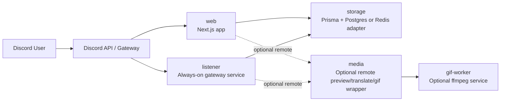

<div align="center">

# Nextjs Discord Bot

**Start on Render, split later.**  
**A composable Discord bot with slash commands, guild settings, FAQ storage, and automatic preview cards for X / Twitter, Pixiv, and Bluesky.**

<p>
  <a href="./README.md">English</a> · <a href="./README-zhtw.md">繁體中文</a> · <a href="./README-zhcn.md">简体中文</a>
</p>

<p>
  
  
  
  
  
  
</p>

</div>

## Table of Contents

- [Overview](#overview)
- [Deployment Profiles](#deployment-profiles)
- [One-Click Deploy](#one-click-deploy)
- [Service Model](#service-model)
- [Quick Start: Render Standard](#quick-start-render-standard)
- [Environment Variables](#environment-variables)
- [Split Deployment Examples](#split-deployment-examples)
- [Runbooks](#runbooks)
- [Development Commands](#development-commands)

## Overview

This repository is a Discord bot built with **Next.js App Router** and a composable deployment model:

- Start with a single platform: **Render**
- Keep **Prisma + Postgres** as the default storage layer
- Add an always-on **gateway listener** only when you need auto preview
- Split `web`, `media`, or `gif-worker` out later without changing the command layer

Core features:

- `/ping`
- `/help`
- `/faq`
- `/settings`
- automatic preview cards for X / Twitter, Pixiv, and Bluesky
- optional translate and GIF actions

## Deployment Profiles

| Profile           | Required services                                           | FAQ / settings | Auto preview | Translate                            | GIF                            | Platform count |
| ----------------- | ----------------------------------------------------------- | -------------- | ------------ | ------------------------------------ | ------------------------------ | -------------- |
| `Starter`         | `web` + `db`                                                | Yes            | No           | No                                   | No                             | 1              |
| `Render Standard` | `web` + `listener` + `db`                                   | Yes            | Yes          | Optional when provider is configured | Optional via remote gif worker | 1              |
| `Split`           | `web` + `listener` + `db` + optional `media` / `gif-worker` | Yes            | Yes          | Yes                                  | Optional                       | 2+             |

Recommended default:

- Use **Render Standard** for the README path
- Keep `GIF_MODE=disabled` unless you explicitly add a gif worker
- Only expose translate when the translate provider is configured

## One-Click Deploy

Use the button that matches the role you want to launch:

| Target             | What it deploys                                                               | Button                                                                                                                                                                                                                                                                                                                                                                                                                                                                                                                                                                                                                                                                                                                                                                                                                                                                                 |
| ------------------ | ----------------------------------------------------------------------------- | -------------------------------------------------------------------------------------------------------------------------------------------------------------------------------------------------------------------------------------------------------------------------------------------------------------------------------------------------------------------------------------------------------------------------------------------------------------------------------------------------------------------------------------------------------------------------------------------------------------------------------------------------------------------------------------------------------------------------------------------------------------------------------------------------------------------------------------------------------------------------------------- |
| `Render Standard`  | Full stack on Render with `web` + `listener` + `db`                           | [](https://render.com/deploy?repo=https%3A%2F%2Fgithub.com%2FBlackishGreen33%2FNextjs-Discord-Bot)                                                                                                                                                                                                                                                                                                                                                                                                                                                                                                                                                                                                                                                                                                           |
| `Vercel Web`       | `web` only. Bring your own Postgres and keep `listener` on an always-on host. | [](https://vercel.com/new/clone?repository-url=https%3A%2F%2Fgithub.com%2FBlackishGreen33%2FNextjs-Discord-Bot&project-name=nextjs-discord-bot-web&build-command=pnpm%20prisma%3Agenerate%20%26%26%20pnpm%20build&env=NEXT_PUBLIC_APPLICATION_ID%2CPUBLIC_KEY%2CBOT_TOKEN%2CREGISTER_COMMANDS_KEY%2CDATABASE_URL%2CSTORAGE_DRIVER%2CMEDIA_MODE%2CGIF_MODE%2CTRANSLATE_PROVIDER&envDescription=Set%20Discord%20app%20secrets%20and%20an%20external%20Postgres%20URL.%20Auto%20preview%20still%20needs%20the%20gateway%20listener%20on%20an%20always-on%20host.&envLink=https%3A%2F%2Fgithub.com%2FBlackishGreen33%2FNextjs-Discord-Bot%23environment-variables&envDefaults=%7B%22STORAGE_DRIVER%22%3A%22prisma%22%2C%22MEDIA_MODE%22%3A%22embedded%22%2C%22GIF_MODE%22%3A%22disabled%22%2C%22TRANSLATE_PROVIDER%22%3A%22disabled%22%7D) |
| `Cloudflare Media` | Optional remote `media` service from `worker/cloudflare-media-proxy`          | [](https://deploy.workers.cloudflare.com/?url=https%3A%2F%2Fgithub.com%2FBlackishGreen33%2FNextjs-Discord-Bot%2Ftree%2Fmain%2Fworker%2Fcloudflare-media-proxy)                                                                                                                                                                                                                                                                                                                                                                                                                                                                                                                                                                                                                                                    |

Notes:

- The Render button uses [`render.yaml`](./render.yaml) to provision the recommended `Render Standard` profile.
- The Vercel button only covers the `web` role. Auto preview still requires `listener`.
- The Cloudflare button deploys only the optional remote `media` wrapper.
- Railway's official deploy button requires a published template, so this repo does not expose a Railway button yet.

## Service Model



Runtime roles:

- `web`
  Handles slash commands, interaction verification, component callbacks, command registration, and debug routes.
- `listener`
  Maintains the Discord Gateway connection and is the only service that should auto-reply to `MESSAGE_CREATE`.
- `media`
  Optional remote wrapper for `/v1/preview`, `/v1/translate`, and `/v1/gif`. Keep it local by default with `MEDIA_MODE=embedded`.
- `gif-worker`
  Optional ffmpeg-backed conversion service. Only required when you want GIF generation.

## Quick Start: Render Standard

This is the official recommended path.

### 1. Install dependencies

```bash
pnpm install
pnpm prisma:generate
```

### 2. Create environment variables

```bash
cp .env.example .env.local
```

Minimum Render Standard env set:

```bash
NEXT_PUBLIC_APPLICATION_ID=
PUBLIC_KEY=
BOT_TOKEN=
REGISTER_COMMANDS_KEY=
DISCORD_GATEWAY_TOKEN=

STORAGE_DRIVER=prisma
DATABASE_URL=

MEDIA_MODE=embedded
GIF_MODE=disabled
TRANSLATE_PROVIDER=disabled
```

### 3. Provision Postgres and apply the schema

Create a **Render Postgres** instance and set `DATABASE_URL` for both:

- `discord-bot-web`
- `discord-bot-listener`

Then run this once from a machine that can reach the database:

```bash
pnpm prisma:push
```

### 4. Deploy the web app

Recommended Render web service settings:

- Build command: `pnpm install && pnpm prisma:generate && pnpm build`
- Start command: `pnpm start`

### 5. Deploy the gateway listener

Recommended Render web service settings:

- Build command: `pnpm install && pnpm prisma:generate`
- Start command: `pnpm gateway:listen`
- Health check path: `/healthz`

Notes:

- Keep exactly **one** active production listener instance
- Choose a region that can pass both Discord Gateway login and Discord REST probing

### 6. Register commands

Development:

- Use the homepage button, or call `POST /api/discord-bot/register-commands`

Production:

- Call `POST /api/discord-bot/register-commands`
- Include `Authorization: Bearer <REGISTER_COMMANDS_KEY>`

### 7. Validate the deployment

Check:

- `https://<listener>/healthz`
- `/settings` and `/faq` inside a guild
- a fresh `x.com`, `pixiv.net`, or `bsky.app` link in a guild channel

## Environment Variables

### Discord Core

| Variable                     | Required by       | Notes                                               |
| ---------------------------- | ----------------- | --------------------------------------------------- |
| `NEXT_PUBLIC_APPLICATION_ID` | `web`             | Discord application ID                              |
| `PUBLIC_KEY`                 | `web`             | Discord interaction verification key                |
| `BOT_TOKEN`                  | `web`, `listener` | Bot token                                           |
| `REGISTER_COMMANDS_KEY`      | `web`             | Protects production command registration            |
| `DISCORD_GATEWAY_TOKEN`      | `listener`        | Optional dedicated token; falls back to `BOT_TOKEN` |

### Storage

| Variable                   | Required by       | Notes                                 |
| -------------------------- | ----------------- | ------------------------------------- |
| `STORAGE_DRIVER`           | `web`, `listener` | `prisma` (default) or `redis`         |
| `DATABASE_URL`             | `web`, `listener` | Required when `STORAGE_DRIVER=prisma` |
| `UPSTASH_REDIS_REST_URL`   | `web`, `listener` | Required when `STORAGE_DRIVER=redis`  |
| `UPSTASH_REDIS_REST_TOKEN` | `web`, `listener` | Required when `STORAGE_DRIVER=redis`  |
| `REDIS_NAMESPACE`          | `web`, `listener` | Optional Redis key namespace          |

### Media

| Variable                 | Required by                | Notes                                                   |
| ------------------------ | -------------------------- | ------------------------------------------------------- |
| `MEDIA_MODE`             | `web`, `listener`          | `embedded` (default), `remote`, or `disabled`           |
| `MEDIA_SERVICE_BASE_URL` | `web`, `listener`          | Required when `MEDIA_MODE=remote`                       |
| `MEDIA_SERVICE_TOKEN`    | `web`, `listener`          | Optional bearer token for remote media service          |
| `MEDIA_TIMEOUT_MS`       | `web`, `listener`          | Timeout for remote media requests                       |
| `MEDIA_ALLOWED_DOMAINS`  | `web`, `listener`, `media` | Comma-separated allowlist for supported preview domains |
| `TRANSLATE_PROVIDER`     | `web`, `listener`          | `disabled` (default) or `libretranslate`                |
| `TRANSLATE_API_BASE_URL` | `web`, `listener`, `media` | Required for embedded LibreTranslate mode               |
| `TRANSLATE_API_KEY`      | `web`, `listener`, `media` | Optional translate provider key                         |

### GIF

| Variable               | Required by                | Notes                                     |
| ---------------------- | -------------------------- | ----------------------------------------- |
| `GIF_MODE`             | `web`, `listener`          | `disabled` (default) or `remote`          |
| `GIF_SERVICE_BASE_URL` | `web`, `listener`, `media` | Required when `GIF_MODE=remote`           |
| `GIF_SERVICE_TOKEN`    | `web`, `listener`, `media` | Optional bearer token for the gif service |
| `FFMPEG_TIMEOUT_SEC`   | `gif-worker`               | gif-worker only                           |
| `MAX_GIF_DURATION_SEC` | `gif-worker`               | gif-worker only                           |
| `GIF_SCALE_WIDTH`      | `gif-worker`               | gif-worker only                           |
| `GIF_FPS`              | `gif-worker`               | gif-worker only                           |

### Listener

| Variable                        | Required by | Notes                                    |
| ------------------------------- | ----------- | ---------------------------------------- |
| `GATEWAY_ATTACHMENT_MAX_BYTES`  | `listener`  | Max bytes per relayed preview attachment |
| `GATEWAY_ATTACHMENT_MAX_ITEMS`  | `listener`  | Max relayed media items                  |
| `GATEWAY_ATTACHMENT_TIMEOUT_MS` | `listener`  | Per-attachment relay timeout             |

### Legacy Compatibility

The project still accepts these aliases for one deprecation cycle:

- `MEDIA_WORKER_BASE_URL` -> `MEDIA_SERVICE_BASE_URL`
- `MEDIA_WORKER_TOKEN` -> `MEDIA_SERVICE_TOKEN`
- `MEDIA_WORKER_TIMEOUT_MS` -> `MEDIA_TIMEOUT_MS`

## Split Deployment Examples

### 1. Move `web` to Vercel, keep `listener + db` on Render

- Keep the same Discord core envs
- Keep `listener` on an always-on host
- Share the same `DATABASE_URL`

### 2. Move `media` to Cloudflare Worker

- Set `MEDIA_MODE=remote`
- Point `MEDIA_SERVICE_BASE_URL` at the worker
- Use `MEDIA_SERVICE_TOKEN` for bearer auth if needed
- Keep `/v1/preview`, `/v1/translate`, and `/v1/gif` unchanged

### 3. Add a dedicated `gif-worker`

- Keep `MEDIA_MODE=embedded`
- Set `GIF_MODE=remote`
- Point `GIF_SERVICE_BASE_URL` at the ffmpeg worker
- Keep preview working even when GIF is disabled or unavailable

## Runbooks

Advanced operational details live here:

- [Render Gateway Listener Runbook](docs/en/runbooks/render-gateway-listener.md)
- [Production Register-Commands Runbook](docs/en/runbooks/register-commands.md)
- [Optional Cloudflare Media Service](worker/cloudflare-media-proxy/README.md)
- [Optional Render GIF Worker](worker/render-gif-api/README.md)

## Development Commands

| Command                | Purpose                                            |
| ---------------------- | -------------------------------------------------- |
| `pnpm dev`             | Start the local development server                 |
| `pnpm build`           | Build the production bundle                        |
| `pnpm start`           | Start the production server                        |
| `pnpm gateway:listen`  | Start the gateway listener                         |
| `pnpm prisma:generate` | Generate the Prisma client                         |
| `pnpm prisma:push`     | Apply the Prisma schema to the configured database |
| `pnpm worker:smoke`    | Smoke test a live remote media service             |
| `pnpm lint`            | Run ESLint                                         |
| `pnpm typecheck`       | Run `tsc --noEmit`                                 |
| `pnpm test`            | Run Vitest                                         |
| `pnpm prettier`        | Run Prettier                                       |
