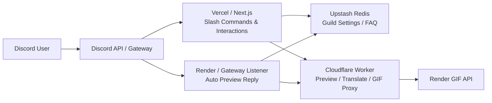

<div align="center">

# Nextjs Discord Bot

**A Discord bot built with Next.js App Router, discord.js, Cloudflare Workers, Upstash Redis, and Render**  
**Provides slash commands, guild FAQ storage, and automatic preview cards for X / Twitter, Pixiv, and Bluesky.**

<p>
  <a href="./README.md">English</a> · <a href="./README-zhtw.md">繁體中文</a> · <a href="./README-zhcn.md">简体中文</a>
</p>

<p>
  
  
  
  
  
  
  
  
</p>

</div>

## Table of Contents

- [Overview](#overview)
- [Features](#features)
- [Architecture](#architecture)
- [Recommended MVP Deployment](#recommended-mvp-deployment)
- [Quick Start](#quick-start)
- [Environment Variables](#environment-variables)
- [Slash Commands](#slash-commands)
- [Auto Preview System](#auto-preview-system)
- [Recommended Render Gateway Listener Setup](#recommended-render-gateway-listener-setup)
- [Runbooks](#runbooks)
- [Development Commands](#development-commands)
- [Project Structure](#project-structure)
- [External References](#external-references)

## Overview

This repository is a Discord bot built with **Next.js App Router** and a split deployment architecture:

- **Vercel / Next.js**: slash commands, interactions, settings, FAQ
- **Cloudflare Worker**: preview normalization, translate proxy, GIF proxy
- **Render GIF API**: GIF conversion
- **Render Gateway Listener**: persistent Discord Gateway listener for automatic preview replies
- **Upstash Redis**: guild settings, FAQ, shared state

The project intentionally separates webhook interactions, preview processing, GIF jobs, and the persistent gateway connection so each piece can be deployed and operated independently.

## Features

### Slash Commands

- `/ping`: basic health check
- `/help`: list available commands and quick-start notes
- `/faq`: guild FAQ storage and lookup
- `/settings`: guild-level auto preview settings panel

### Automatic Preview Cards

When a user posts a supported URL in a guild channel, the bot can automatically reply with a preview card.

Currently supported:

- X / Twitter
- Pixiv
- Bluesky

Preview actions include:

- author / platform metadata
- text and engagement counters
- image / video preview
- `🌐` translate
- `🎬` convert to GIF
- `🗑️` retract preview

### Guild-Level Settings

`/settings` supports:

- global auto preview on/off
- platform toggles for Twitter, Pixiv, and Bluesky
- feature toggles for Translate and GIF
- output mode: `embed` / `image`
- NSFW media mode
- default translation target language

## Architecture



## Recommended MVP Deployment

| Module           | Responsibility                  | Recommended host   |
| ---------------- | ------------------------------- | ------------------ |
| Next.js App      | Slash commands / interactions   | Vercel             |
| Gateway Listener | Always-on auto-preview process  | Render Web Service |
| Media Proxy      | Preview / translate / GIF proxy | Cloudflare Workers |
| GIF API          | GIF conversion                  | Render Web Service |
| Redis            | Guild settings / FAQ            | Upstash Redis      |

> [!NOTE]
> For the gateway listener, choose a region that can reliably pass both Discord Gateway login and Discord REST probing. If a region returns `429` or `Access denied`, redeploy in a different region instead of treating it as a cold-start issue.

## Quick Start

### 1. Install dependencies

```bash
pnpm install
```

### 2. Create environment variables

Start from `.env.example`:

```bash
cp .env.example .env.local
```

### 3. Start the local development server

```bash
pnpm dev
```

### 4. Start the gateway listener for auto preview testing

```bash
pnpm gateway:listen
```

## Environment Variables

### Core Required

| Variable                     | Description                                              |
| ---------------------------- | -------------------------------------------------------- |
| `NEXT_PUBLIC_APPLICATION_ID` | Discord application ID                                   |
| `PUBLIC_KEY`                 | Discord interaction public key                           |
| `BOT_TOKEN`                  | Discord bot token                                        |
| `REGISTER_COMMANDS_KEY`      | Bearer key for protected production command registration |

### Redis / Guild Settings

| Variable                   | Description                                |
| -------------------------- | ------------------------------------------ |
| `UPSTASH_REDIS_REST_URL`   | Upstash Redis REST URL                     |
| `UPSTASH_REDIS_REST_TOKEN` | Upstash Redis REST token                   |
| `REDIS_NAMESPACE`          | Redis key namespace, default `discord-bot` |

### Media Worker / Preview Chain

| Variable                  | Description                                   |
| ------------------------- | --------------------------------------------- |
| `MEDIA_WORKER_BASE_URL`   | Cloudflare Worker base URL                    |
| `MEDIA_WORKER_TOKEN`      | Worker bearer token                           |
| `MEDIA_WORKER_TIMEOUT_MS` | Timeout when the app calls the media worker   |
| `MEDIA_ALLOWED_DOMAINS`   | Comma-separated allowlist for preview domains |

### Gateway Listener

| Variable                        | Description                                        |
| ------------------------------- | -------------------------------------------------- |
| `DISCORD_GATEWAY_TOKEN`         | Dedicated gateway token; falls back to `BOT_TOKEN` |
| `GATEWAY_ATTACHMENT_MAX_BYTES`  | Maximum bytes per relayed preview attachment       |
| `GATEWAY_ATTACHMENT_MAX_ITEMS`  | Maximum relayed media items                        |
| `GATEWAY_ATTACHMENT_TIMEOUT_MS` | Per-attachment relay timeout                       |

## Slash Commands

| Command                   | Description                                      |
| ------------------------- | ------------------------------------------------ |
| `/ping`                   | Check whether the bot responds                   |
| `/help`                   | Show available commands and quick-start info     |
| `/faq get <key>`          | Look up an FAQ entry                             |
| `/faq list`               | List FAQ keys                                    |
| `/faq set <key> <answer>` | Create or update FAQ entries as admin            |
| `/faq delete <key>`       | Delete FAQ entries as admin                      |
| `/settings`               | Open the guild-level auto preview settings panel |

## Auto Preview System

### Supported Platforms

- `x.com`
- `twitter.com`
- `pixiv.net`
- `www.pixiv.net`
- `bsky.app`

### Flow

1. A user posts a supported URL in a guild channel
2. The Render gateway listener receives `MESSAGE_CREATE`
3. The listener reads guild settings and platform toggles
4. The listener calls the Cloudflare Worker to fetch a normalized preview payload
5. The bot replies with a preview card and native Discord media attachments when appropriate

### Preview Actions

| Action | Purpose                                     |
| ------ | ------------------------------------------- |
| `🌐`   | Translate the post content                  |
| `🎬`   | Send convertible media to the GIF API       |
| `🗑️`   | Retract the preview message sent by the bot |

## Recommended Render Gateway Listener Setup

Recommended MVP setup:

- **Host**: Render Web Service
- **Health Check Path**: `/healthz`
- **Optional keepalive**: UptimeRobot or an equivalent external monitor that periodically requests `/healthz`
- **Region rule**: use a region that can successfully complete both Discord Gateway login and Discord REST probing

> [!TIP]
> If your free web service sleeps, a keepalive monitor can reduce cold starts. It does not solve Discord or Cloudflare blocking a region's outbound traffic.

## Runbooks

- [Render Gateway Listener Runbook](docs/en/runbooks/render-gateway-listener.md)
- [Production Register-Commands Runbook](docs/en/runbooks/register-commands.md)

## Development Commands

| Command               | Purpose                            |
| --------------------- | ---------------------------------- |
| `pnpm dev`            | Start the local development server |
| `pnpm build`          | Build the production bundle        |
| `pnpm start`          | Start the production server        |
| `pnpm lint`           | Run ESLint                         |
| `pnpm typecheck`      | Run `tsc --noEmit`                 |
| `pnpm test`           | Run Vitest                         |
| `pnpm prettier`       | Run Prettier                       |
| `pnpm gateway:listen` | Start the gateway listener         |
| `pnpm worker:smoke`   | Smoke test the live media worker   |

## Project Structure

```text
.
├── README.md
├── README-zhtw.md
├── README-zhcn.md
├── AGENTS.md
├── docs/
│   ├── en/
│   │   └── runbooks/
│   │       ├── register-commands.md
│   │       └── render-gateway-listener.md
│   ├── zhtw/
│   │   └── runbooks/
│   │       ├── register-commands.md
│   │       └── render-gateway-listener.md
│   └── zhcn/
│       └── runbooks/
│           ├── register-commands.md
│           └── render-gateway-listener.md
├── public/
│   └── favicon.ico
├── scripts/
│   └── smoke-media-worker.mjs
├── src/
│   ├── app/
│   │   ├── layout.tsx
│   │   ├── page.tsx
│   │   └── api/
│   │       └── discord-bot/
│   │           ├── debug/
│   │           │   ├── route.ts
│   │           │   └── route.test.ts
│   │           ├── interactions/
│   │           │   ├── route.ts
│   │           │   └── route.test.ts
│   │           └── register-commands/
│   │               ├── route.ts
│   │               └── route.test.ts
│   ├── commands/
│   │   ├── faq.ts
│   │   ├── faq.test.ts
│   │   ├── help.ts
│   │   ├── index.ts
│   │   ├── ping.ts
│   │   ├── settings.ts
│   │   └── settings.test.ts
│   └── common/
│       ├── configs/
│       │   └── index.ts
│       ├── stores/
│       │   ├── faq-store.ts
│       │   ├── faq-store.test.ts
│       │   ├── guild-settings-store.ts
│       │   ├── guild-settings-store.test.ts
│       │   └── index.ts
│       ├── styles/
│       │   └── globals.css
│       ├── types/
│       │   └── index.ts
│       └── utils/
│           ├── auth.ts
│           ├── auth.test.ts
│           ├── discord-api.ts
│           ├── discord-api.test.ts
│           ├── getCommands.ts
│           ├── index.ts
│           ├── media-component-handler.ts
│           ├── media-component-handler.test.ts
│           ├── media-link.ts
│           ├── media-link.test.ts
│           ├── media-worker.ts
│           ├── media-worker.test.ts
│           ├── preview-card.ts
│           ├── request-logger.ts
│           ├── settings-actor.ts
│           ├── settings-panel.ts
│           ├── ui-copy.json
│           ├── ui-text.ts
│           ├── verify-discord-request.ts
│           └── verify-discord-request.test.ts
└── worker/
    ├── cloudflare-media-proxy/
    │   ├── README.md
    │   ├── wrangler.toml
    │   └── src/
    │       ├── index.ts
    │       └── index.test.ts
    ├── gateway-listener/
    │   ├── README.md
    │   ├── index.mjs
    │   ├── preview-attachments.mjs
    │   ├── preview-attachments.test.ts
    │   └── ui-text.mjs
    └── render-gif-api/
        ├── README.md
        ├── Dockerfile
        ├── app.py
        ├── requirements.txt
        └── start.sh
```

## External References

- [Render Web Services](https://render.com/docs/web-services)
- [Render Health Checks](https://render.com/docs/health-checks)
- [Render Deploys](https://render.com/docs/deploys)
- [Discord Gateway](https://docs.discord.com/developers/events/gateway)
- [Discord Events Overview](https://docs.discord.com/developers/events/overview)
