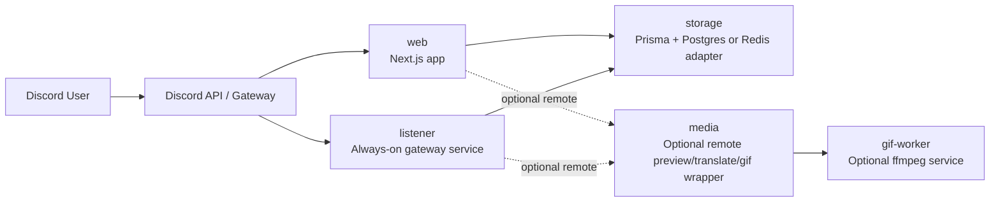

<div align="center">

# Nextjs Discord Bot

**Composable Discord bot built with Next.js App Router and TypeScript.**  
Slash commands, guild settings, FAQ storage, and automatic preview cards for X / Twitter, Pixiv, and Bluesky.

<p>
  <a href="./README.md">English</a> ·
  <a href="./README-zhtw.md">繁體中文</a> ·
  <a href="./README-zhcn.md">简体中文</a>
</p>

<p>
  <a href="https://github.com/BlackishGreen33/Nextjs-Discord-Bot/actions/workflows/lint_and_format_check.yml">
    
  </a>
  <a href="./LICENSE.md">
    
  </a>
  
  
</p>

<p>
  
  
  
  
  
</p>

<p>
  <a href="#quick-start">Quick Start</a> ·
  <a href="#deployment">Deployment</a> ·
  <a href="#environment-reference">Environment</a> ·
  <a href="#runbooks">Runbooks</a> ·
  <a href="#development-commands">Commands</a>
</p>

</div>

## Highlights

- Slash commands: `/ping`, `/help`, `/faq`, `/settings`
- Verified Discord interaction flow on `POST /api/discord-bot/interactions`
- Automatic preview cards for X / Twitter, Pixiv, and Bluesky
- Optional translate and GIF actions through the media pipeline
- Prisma + Postgres as the default storage path, with Redis storage variables supported
- Deployment model that can start simple and split into `web`, `listener`, `media`, and `gif-worker`

## Architecture



| Role         | Responsibility                                                                                        |
| ------------ | ----------------------------------------------------------------------------------------------------- |
| `web`        | Slash commands, interaction verification, component callbacks, command registration, and debug routes |
| `listener`   | Persistent Discord Gateway connection and auto preview replies for `MESSAGE_CREATE`                   |
| `media`      | Optional remote wrapper for `/v1/preview`, `/v1/translate`, and `/v1/gif`                             |
| `gif-worker` | Optional ffmpeg-backed conversion service when GIF generation is enabled                              |

## Project Layout

```text
src/app/api/discord-bot/        Next.js routes for interactions, command registration, and debug checks
src/commands/                   Slash command implementations
src/common/                     Shared configs, stores, types, and media utilities
worker/gateway-listener/        Always-on Discord Gateway listener for auto preview
worker/cloudflare-media-proxy/  Optional remote media proxy
worker/render-gif-api/          Optional Render-friendly GIF worker
docs/en/runbooks/               English deployment and operations runbooks
```

## Quick Start

### Requirements

- Node.js `20+`
- pnpm `10+`

### 1. Create local environment

```bash
cp .env.example .env.local
```

Start from [`.env.example`](./.env.example). The default local path expects:

```bash
STORAGE_DRIVER=prisma
DATABASE_URL=
MEDIA_MODE=embedded
GIF_MODE=disabled
TRANSLATE_PROVIDER=disabled
```

### 2. Install dependencies

```bash
pnpm install
pnpm prisma:generate
```

### 3. Apply the Prisma schema

```bash
pnpm prisma:push
```

### 4. Start the web app

```bash
pnpm dev
```

### 5. Start the gateway listener when testing auto preview

```bash
pnpm gateway:listen
```

> [!IMPORTANT]
> Automatic preview is not handled directly by the Next.js webhook routes. Local preview testing requires the separate gateway listener process.

### 6. Register slash commands

In development, use the home page button or call:

```http
POST /api/discord-bot/register-commands
```

In production, include:

```http
Authorization: Bearer <REGISTER_COMMANDS_KEY>
```

> [!NOTE]
> `POST /api/discord-bot/register-commands` is rate-limited to `5` requests per IP per minute.

## Deployment

> [!TIP]
> `Render Standard` is the repo's primary deployment path: `web + listener + db` on one platform.

### Deployment Profiles

| Profile           | Required services                                           | FAQ / settings | Auto preview | Translate                            | GIF                            | Platform count |
| ----------------- | ----------------------------------------------------------- | -------------- | ------------ | ------------------------------------ | ------------------------------ | -------------- |
| `Starter`         | `web` + `db`                                                | Yes            | No           | No                                   | No                             | 1              |
| `Render Standard` | `web` + `listener` + `db`                                   | Yes            | Yes          | Optional when provider is configured | Optional via remote gif worker | 1              |
| `Split`           | `web` + `listener` + `db` + optional `media` / `gif-worker` | Yes            | Yes          | Yes                                  | Optional                       | 2+             |

Recommended defaults:

- Use `Render Standard` unless you already need a split runtime
- Keep `GIF_MODE=disabled` until a dedicated GIF service exists
- Only expose translate when the provider is configured

### One-Click Deploy

| Target             | What it deploys                                                               | Button                                                                                                                                                                                                                                                                                                                                                                                                                                                                                                                                                                                                                                                                                                                                                                                                                                                                                 |
| ------------------ | ----------------------------------------------------------------------------- | -------------------------------------------------------------------------------------------------------------------------------------------------------------------------------------------------------------------------------------------------------------------------------------------------------------------------------------------------------------------------------------------------------------------------------------------------------------------------------------------------------------------------------------------------------------------------------------------------------------------------------------------------------------------------------------------------------------------------------------------------------------------------------------------------------------------------------------------------------------------------------------- |
| `Render Standard`  | Full stack on Render with `web` + `listener` + `db`                           | [](https://render.com/deploy?repo=https%3A%2F%2Fgithub.com%2FBlackishGreen33%2FNextjs-Discord-Bot)                                                                                                                                                                                                                                                                                                                                                                                                                                                                                                                                                                                                                                                                                                           |
| `Vercel Web`       | `web` only. Bring your own Postgres and keep `listener` on an always-on host. | [](https://vercel.com/new/clone?repository-url=https%3A%2F%2Fgithub.com%2FBlackishGreen33%2FNextjs-Discord-Bot&project-name=nextjs-discord-bot-web&build-command=pnpm%20prisma%3Agenerate%20%26%26%20pnpm%20build&env=NEXT_PUBLIC_APPLICATION_ID%2CPUBLIC_KEY%2CBOT_TOKEN%2CREGISTER_COMMANDS_KEY%2CDATABASE_URL%2CSTORAGE_DRIVER%2CMEDIA_MODE%2CGIF_MODE%2CTRANSLATE_PROVIDER&envDescription=Set%20Discord%20app%20secrets%20and%20an%20external%20Postgres%20URL.%20Auto%20preview%20still%20needs%20the%20gateway%20listener%20on%20an%20always-on%20host.&envLink=https%3A%2F%2Fgithub.com%2FBlackishGreen33%2FNextjs-Discord-Bot%23environment-reference&envDefaults=%7B%22STORAGE_DRIVER%22%3A%22prisma%22%2C%22MEDIA_MODE%22%3A%22embedded%22%2C%22GIF_MODE%22%3A%22disabled%22%2C%22TRANSLATE_PROVIDER%22%3A%22disabled%22%7D) |
| `Cloudflare Media` | Optional remote `media` service from `worker/cloudflare-media-proxy`          | [](https://deploy.workers.cloudflare.com/?url=https%3A%2F%2Fgithub.com%2FBlackishGreen33%2FNextjs-Discord-Bot%2Ftree%2Fmain%2Fworker%2Fcloudflare-media-proxy)                                                                                                                                                                                                                                                                                                                                                                                                                                                                                                                                                                                                                                                    |

Deployment notes:

- The Render button uses [`render.yaml`](./render.yaml) for the recommended `Render Standard` profile
- The Vercel button covers only the `web` role; auto preview still requires `listener`
- The Cloudflare button deploys only the optional remote `media` wrapper
- Railway's official deploy button requires a published template, so this repo does not expose a Railway button yet

### Render Standard Checklist

#### 1. Set the minimum environment variables

```bash
NEXT_PUBLIC_APPLICATION_ID=
PUBLIC_KEY=
BOT_TOKEN=
REGISTER_COMMANDS_KEY=
DISCORD_GATEWAY_TOKEN=

STORAGE_DRIVER=prisma
DATABASE_URL=

MEDIA_MODE=embedded
GIF_MODE=disabled
TRANSLATE_PROVIDER=disabled
```

#### 2. Provision Postgres and apply the schema

Create a shared Postgres database for:

- `discord-bot-web`
- `discord-bot-listener`

Then run:

```bash
pnpm prisma:push
```

#### 3. Deploy the web service

- Build command: `pnpm install && pnpm prisma:generate && pnpm build`
- Start command: `pnpm start`

#### 4. Deploy the gateway listener

- Build command: `pnpm install && pnpm prisma:generate`
- Start command: `pnpm gateway:listen`
- Health check path: `/healthz`

#### 5. Register commands and validate

Check:

- `POST /api/discord-bot/register-commands`
- `https://<listener>/healthz`
- `/settings` and `/faq` in a guild
- A fresh `x.com`, `pixiv.net`, or `bsky.app` link in a guild channel

## Environment Reference

Start from [`.env.example`](./.env.example).

<details>
<summary><strong>Discord Core</strong></summary>

| Variable                     | Required by       | Notes                                               |
| ---------------------------- | ----------------- | --------------------------------------------------- |
| `NEXT_PUBLIC_APPLICATION_ID` | `web`             | Discord application ID                              |
| `PUBLIC_KEY`                 | `web`             | Discord interaction verification key                |
| `BOT_TOKEN`                  | `web`, `listener` | Bot token                                           |
| `REGISTER_COMMANDS_KEY`      | `web`             | Protects production command registration            |
| `DISCORD_GATEWAY_TOKEN`      | `listener`        | Optional dedicated token; falls back to `BOT_TOKEN` |

</details>

<details>
<summary><strong>Storage</strong></summary>

| Variable                   | Required by       | Notes                                 |
| -------------------------- | ----------------- | ------------------------------------- |
| `STORAGE_DRIVER`           | `web`, `listener` | `prisma` (default) or `redis`         |
| `DATABASE_URL`             | `web`, `listener` | Required when `STORAGE_DRIVER=prisma` |
| `UPSTASH_REDIS_REST_URL`   | `web`, `listener` | Required when `STORAGE_DRIVER=redis`  |
| `UPSTASH_REDIS_REST_TOKEN` | `web`, `listener` | Required when `STORAGE_DRIVER=redis`  |
| `REDIS_NAMESPACE`          | `web`, `listener` | Optional Redis key namespace          |

</details>

<details>
<summary><strong>Media</strong></summary>

| Variable                 | Required by                | Notes                                                   |
| ------------------------ | -------------------------- | ------------------------------------------------------- |
| `MEDIA_MODE`             | `web`, `listener`          | `embedded` (default), `remote`, or `disabled`           |
| `MEDIA_SERVICE_BASE_URL` | `web`, `listener`          | Required when `MEDIA_MODE=remote`                       |
| `MEDIA_SERVICE_TOKEN`    | `web`, `listener`          | Optional bearer token for the remote media service      |
| `MEDIA_TIMEOUT_MS`       | `web`, `listener`          | Timeout for remote media requests                       |
| `MEDIA_ALLOWED_DOMAINS`  | `web`, `listener`, `media` | Comma-separated allowlist for supported preview domains |
| `TRANSLATE_PROVIDER`     | `web`, `listener`          | `disabled` (default) or `libretranslate`                |
| `TRANSLATE_API_BASE_URL` | `web`, `listener`, `media` | Required for embedded LibreTranslate mode               |
| `TRANSLATE_API_KEY`      | `web`, `listener`, `media` | Optional translate provider key                         |

</details>

<details>
<summary><strong>GIF</strong></summary>

| Variable               | Required by                | Notes                                     |
| ---------------------- | -------------------------- | ----------------------------------------- |
| `GIF_MODE`             | `web`, `listener`          | `disabled` (default) or `remote`          |
| `GIF_SERVICE_BASE_URL` | `web`, `listener`, `media` | Required when `GIF_MODE=remote`           |
| `GIF_SERVICE_TOKEN`    | `web`, `listener`, `media` | Optional bearer token for the GIF service |
| `FFMPEG_TIMEOUT_SEC`   | `gif-worker`               | gif-worker only                           |
| `MAX_GIF_DURATION_SEC` | `gif-worker`               | gif-worker only                           |
| `GIF_SCALE_WIDTH`      | `gif-worker`               | gif-worker only                           |
| `GIF_FPS`              | `gif-worker`               | gif-worker only                           |

</details>

<details>
<summary><strong>Listener</strong></summary>

| Variable                        | Required by | Notes                                    |
| ------------------------------- | ----------- | ---------------------------------------- |
| `GATEWAY_ATTACHMENT_MAX_BYTES`  | `listener`  | Max bytes per relayed preview attachment |
| `GATEWAY_ATTACHMENT_MAX_ITEMS`  | `listener`  | Max relayed media items                  |
| `GATEWAY_ATTACHMENT_TIMEOUT_MS` | `listener`  | Per-attachment relay timeout             |

</details>

<details>
<summary><strong>Legacy Compatibility</strong></summary>

The project still accepts these aliases for one deprecation cycle:

- `MEDIA_WORKER_BASE_URL` -> `MEDIA_SERVICE_BASE_URL`
- `MEDIA_WORKER_TOKEN` -> `MEDIA_SERVICE_TOKEN`
- `MEDIA_WORKER_TIMEOUT_MS` -> `MEDIA_TIMEOUT_MS`

</details>

## Runbooks

- [Render Gateway Listener Runbook](docs/en/runbooks/render-gateway-listener.md)
- [Production Register-Commands Runbook](docs/en/runbooks/register-commands.md)
- [Optional Cloudflare Media Service](worker/cloudflare-media-proxy/README.md)
- [Optional Render GIF Worker](worker/render-gif-api/README.md)

## Development Commands

| Command                | Purpose                                            |
| ---------------------- | -------------------------------------------------- |
| `pnpm install`         | Install dependencies                               |
| `pnpm dev`             | Start the local development server                 |
| `pnpm build`           | Build the production bundle                        |
| `pnpm start`           | Start the production server                        |
| `pnpm gateway:listen`  | Start the Discord Gateway listener                 |
| `pnpm prisma:generate` | Generate the Prisma client                         |
| `pnpm prisma:push`     | Apply the Prisma schema to the configured database |
| `pnpm worker:smoke`    | Smoke test a live remote media service             |
| `pnpm lint`            | Run ESLint                                         |
| `pnpm typecheck`       | Run `tsc --noEmit`                                 |
| `pnpm test`            | Run Vitest                                         |
| `pnpm prettier`        | Run Prettier                                       |

## License

Released under the [MIT License](./LICENSE.md).
